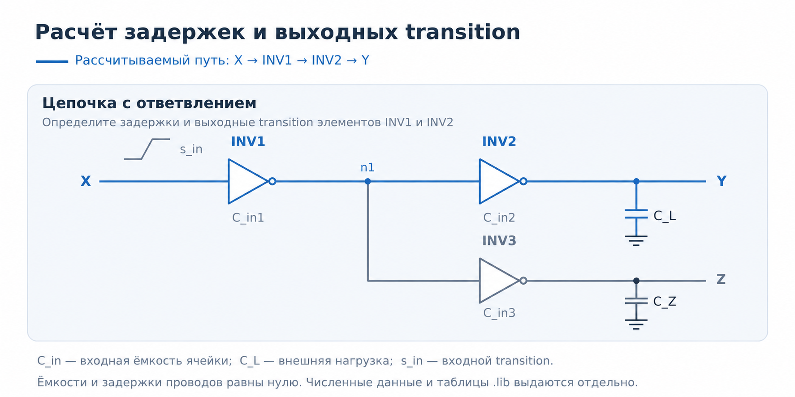
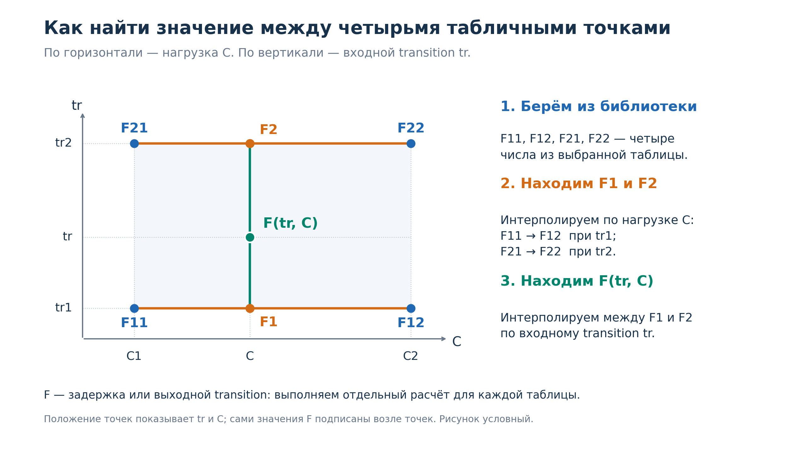

# Лабораторная работа №2
## Логический синтез и формальная проверка

### Цель работы

Цель лабораторной работы — самостоятельно подготовить управляющий скрипт логического синтеза на основе предоставленных процедур, выполнить синтез разработанного RTL-описания в библиотеку стандартных ячеек, проанализировать полученную реализацию и проверить её функциональную эквивалентность (LEC) исходному RTL-описанию.

Дополнительно в работе необходимо освоить ручной расчёт задержек и выходных transition по таблицам библиотеки стандартных ячеек с использованием билинейной интерполяции.

Полученный в данной лабораторной работе список соединений будет использоваться на последующих этапах физической реализации цифровой интегральной схемы.

# Задание 1. Логический синтез и формальная проверка

На основе RTL-описания, разработанного и проверенного в лабораторной работе №1, выполните логический синтез своего функционального блока: `blockA` или `blockB`.

Для выполнения работы необходимо:

1. Подготовить исходные данные для синтеза своего блока.
2. Изучить предоставленный файл `steps.genus.tcl` и самостоятельно составить управляющий Tcl-скрипт, расположив вызовы процедур в необходимой последовательности.
3. Выполнить логический синтез в Cadence Genus с использованием предоставленных библиотеки стандартных ячеек и временных ограничений.
4. Проанализировать состав и количество полученных ячеек, их суммарную площадь и временные характеристики схемы по отчётам папки `reports`.
5. Подготовить скрипт проверки и выполнить формальную проверку эквивалентности исходного RTL-описания и синтезированного списка соединений в Cadence Conformal (LEC).
6. Провести эксперимент с намеренным нарушением эквивалентности и объяснить результат проверки.
7. Сохранить результаты для защиты и дальнейшего использования в курсе.

## Требования к управляющему скрипту flow.genus.syn.tcl

Для выполнения работы предоставляется файл `steps.genus.tcl`, содержащий процедуры для отдельных этапов работы в Cadence Genus. Окружение запуска, библиотека стандартных ячеек и файлы настройки MMMC и SDC предоставляются преподавателем.

Самостоятельно подготовьте управляющий Tcl-скрипт `flow.genus.syn.tcl` для синтеза своего блока.

Изучите переменные окружения, используемые в предоставленных процедурах. Убедитесь, что настройки запуска указывают на ваш блок, его RTL-файлы и соответствующие файлы ограничений.

В скрипте необходимо:

1. Подключить файл `steps.genus.tcl` с помощью команды `source`.
2. Разместить вызовы предоставленных процедур в последовательности, обеспечивающей логический синтез и формирование скрипта для LEC.
3. Добавить краткие комментарии, поясняющие назначение основных этапов.

**Важно:** На защите необходимо объяснить выбранную последовательность вызовов и зависимость каждого основного этапа от результатов предыдущих.

При выполнении синтеза необходимо:

1. Использовать RTL-описание своего блока, прошедшее функциональную проверку в лабораторной работе №1.
2. Указать свой блок в качестве модуля верхнего уровня. Файлы testbench в синтез не включаются.
3. Использовать предоставленную библиотеку стандартных ячеек.
4. Подключить предоставленную конфигурацию MMMC, использующую файл временных ограничений SDC для своего блока. Самостоятельное написание SDC в данной работе не требуется. Необходимо понимать назначение заданных ограничений и уметь объяснить их влияние на синтез и оценку временных характеристик.
5. Выполнить синтез с помощью самостоятельно подготовленного управляющего скрипта.
6. Проанализировать сообщения инструмента. Ошибки должны быть устранены, существенные предупреждения — объяснены или устранены.
7. Сохранить:
   - управляющий Tcl-скрипт и используемый файл `steps.genus.tcl`;
   - итоговый синтезированный netlist;
   - отчёты, формируемые на этапах синтеза;
   - log выполнения синтеза.
8. Сформировать скрипт для осуществления проверки эквивалентности (LEC).

**Важно:** Для проверки эквивалентности (LEC) и дальнейших лабораторных используйте netlist завершённого маршрута синтеза.

Написанный скрипт можно запустить одним из трёх способов:

1. **Напрямую из терминала.** Создайте папку `lab2/run` и перейдите в неё:
   - для интерактивного выполнения запустите `genus`, затем последовательно вводите строки своего скрипта;
   - для выполнения всего скрипта запустите `genus -files ../flow_scripts/flow.genus.syn.tcl`.
2. **Через Makefile в интерактивном режиме.** Выполните `make genus`, затем последовательно вводите строки своего скрипта.
3. **Через Makefile в автоматическом режиме.** Выполните `make synth`. Файл `flow.genus.syn.tcl` будет использован как входной.

Команды `make` выполняйте из каталога с предоставленным Makefile. Настройки своего блока задайте в предоставленном Makefile. Перед прямым запуском Genus необходимые переменные должны быть также доступны в окружении терминала; сам по себе запуск `genus` не читает Makefile.

## Требования к анализу результатов синтеза

Проанализируйте результаты завершающего этапа синтеза — `syn_opt`.

Для своего блока необходимо:

1. Изучить итоговый список соединений netlist — `<название блока>.v`:
   - найти несколько примеров комбинационных и последовательностных ячеек;
   - объяснить их назначение.

2. Определить количество и состав ячеек по отчёту `report_area.rpt`:
   - общее количество ячеек;
   - количество комбинационных и последовательностных ячеек.

3. Определить суммарную площадь стандартных ячеек по отчёту `report_area.rpt`. Указать единицы измерения и объяснить, почему эта величина не равна площади будущего кристалла.

4. Изучить отдельный временной путь в отчёте `report_timing.rpt`:
   - определить начало и конец пути;
   - объяснить, через какие элементы проходит путь;
   - определить значение slack;
   - сделать вывод о выполнении временного ограничения для этого пути.

5. Изучить сводный отчёт о временных характеристиках `report_timing_summary.rpt`:
   - определить, для каких групп путей представлены результаты;
   - определить наихудший slack и наличие временных нарушений;
   - сделать общий вывод о выполнении временных ограничений по представленным в отчёте проверкам.

## Формальная проверка эквивалентности

С помощью предоставленной процедуры `step_genus_lec` сформируйте скрипт проверки эквивалентности. В качестве аргумента передайте путь к итоговому синтезированному списку соединений. В результате будет создан файл `rtl2final.lec.do`, содержащий команды для проверки в Cadence Conformal.

Запустите проверку в Cadence Conformal командой `make lec` или `make lec_nogui`, используя предоставленный скрипт запуска. Он автоматически подключает сформированный в Genus файл `rtl2final.lec.do`. Самостоятельно писать скрипт запуска Conformal не требуется.

Формирование `.do`-файла в Genus только подготавливает команды проверки и не означает, что проверка уже выполнена.

Получите результат, подтверждающий эквивалентность своего блока. Изучите log и итоговый отчёт: убедитесь, что проверка завершена и не содержит недоказанных или неэквивалентных точек сравнения.

После успешной проверки проведите эксперимент:

1. Создайте отдельную копию исходного RTL-описания.
2. Внесите одно изменение, нарушающее функциональное поведение блока. Например, измените арифметическую операцию, условие обновления регистра или значение сброса.
3. Настройте проверку на чтение изменённой копии RTL вместо исходной. Убедитесь по log, что используется именно изменённый файл. Проверяемый netlist оставьте неизменным.
4. Повторите проверку в Cadence Conformal. Повторный синтез для этого эксперимента не выполняется.
5. Проанализируйте отчёт и определите, какие точки сравнения не прошли проверку.
6. Объясните, как внесённое изменение повлияло на поведение схемы и почему нарушилась эквивалентность.

Изменённый RTL должен оставаться синтаксически корректным. Ошибки чтения проекта, синтаксиса или настройки инструмента, а также незавершённое доказательство не считаются демонстрацией нарушения эквивалентности.

Для следующих лабораторных используйте исходную корректную версию проекта и список соединений, успешно прошедший проверку эквивалентности.

# Защита лабораторной работы

Защита допускается с отчётом или без отчёта. Требования к содержанию работы и пониманию результатов одинаковые. В обоих случаях проводится краткая беседа с преподавателем.

## Что необходимо представить для защиты задания 1

- Исходное RTL-описание своего блока.
- Самостоятельно подготовленный управляющий Tcl-скрипт с комментариями.
- Итоговый синтезированный netlist.
- Ручной расчёт задержек и выходных transition для предоставленной схемы: исходные данные, промежуточные вычисления, итоговую таблицу, суммарную задержку пути и объяснение влияния ответвления.
- Log синтеза и отчёты о составе ячеек, площади и временных характеристиках для финального этапа.
- Скрипт, log успешной проверки эквивалентности.
- Изменённую копию RTL и описание внесённой функциональной ошибки.
- Скрипт и результаты проверки с нарушенной эквивалентностью, а также объяснение обнаруженного различия.
-

## Что необходимо уметь объяснить для защиты задания 1

- Назначение логического синтеза и его место в маршруте проектирования.
- Назначение основных процедур в `steps.genus.tcl` и выбранную последовательность их вызовов.
- Различие между определением процедуры и её вызовом, назначение команды `source`.
- Различие между RTL-описанием и netlist.
- Назначение библиотеки `.lib` стандартных ячеек, конфигурации MMMC и предоставленных ограничений SDC.
- Выбор таблиц и порядок ручного расчёта задержки и выходного transition, применение билинейной интерполяции.
- Влияние входного transition и выходной нагрузки на результаты расчёта, передачу transition между последовательными элементами.
- Влияние входной ёмкости `INV3` на рассчитываемый путь через `INV1` и `INV2` и отличие этой ёмкости от нагрузки `C_Z` на выходе `INV3`.
- Состав полученной схемы и смысл её суммарной площади.
- Начало и конец рассмотренного временного пути, значение slack и вывод о выполнении ограничения.
- Назначение проверки эквивалентности и отличие от функционального моделирования.
- Результат успешной проверки и результат эксперимента с функциональной ошибкой.

Оценивание проводится по общим критериям курса с учётом сроков защиты. Получение выходных файлов и успешных сообщений инструментов само по себе не гарантирует высокую оценку: студент должен понимать и уметь объяснить выполненные действия и результаты.

# Задание 2. Расчёт задержек по таблицам библиотеки

Выполните ручной расчёт **задержек и выходных transition** для предоставленной схемы с ответвлением.

Схема, параметры элементов, входной transition и таблицы библиотеки `.lib` одинаковы для всех студентов.

Рассчитайте два пути:

- `X → INV1 → INV2 → Y`;

- `X → INV1 → INV3 → Z`.



## Исходные данные

| Параметр | Значение |
| --- | --- |
| Ячейка для `INV1`, `INV2` и `INV3` | `sg13g2_inv_1` |
| Входной переход в точке `X` | Нарастающий (`0 → 1`) |
| Входной transition `tr_in` (`s_in` на схеме) | 0,08 нс |
| Внешняя нагрузка `C_L` на выходе `Y` | 0,03 пФ |
| Внешняя нагрузка `C_Z` на выходе `Z` | 0,05 пФ |

Входные ёмкости элементов определите по фрагменту библиотеки ниже. Для расчёта используйте атрибут `capacitance`; атрибуты `rise_capacitance` и `fall_capacitance` в данной работе не используются.

Ёмкости и задержки межсоединений примите равными нулю. Дополнительные нагрузки, не указанные на схеме, отсутствуют.

### Фрагменты библиотеки стандартных ячеек

Ниже приведены фрагменты файла `sg13g2_stdcell_typ_1p20V_25C.lib`. Текст внутри каждого блока скопирован из исходного файла без изменения значений, порядка строк и отступов. Это отдельные выдержки для ручного расчёта, а не самостоятельный файл библиотеки.

**Единицы измерения**

```liberty
  capacitive_load_unit (1,pf);
  time_unit : "1ns";
```

**Шаблон таблиц задержек и выходных transition**

```liberty
  lu_table_template (TIMING_DELAY_7x7ds1) {
    variable_1 : input_net_transition;
    variable_2 : total_output_net_capacitance;
    index_1 ("0.0186, 0.0966, 0.174, 0.3294, 0.6408, 1.263, 2.5074");
    index_2 ("0.001, 0.0234, 0.039, 0.0648, 0.108, 0.18, 0.3");
  }
```

**Входной вывод `A` ячейки `sg13g2_inv_1`**

```liberty
    pin (A) {
      direction : "input";
      max_transition : 2.5074;
      capacitance : 0.0028869;
      rise_capacitance : 0.00293856;
      rise_capacitance_range (0.00293856, 0.00293856);
      fall_capacitance : 0.00283525;
      fall_capacitance_range (0.00283525, 0.00283525);
    }
```

**Выходной вывод `Y` и полный блок `timing` ячейки `sg13g2_inv_1`**

Фрагмент заканчивается после блока `timing`. Следующий за ним блок `internal_power` и завершение группы `pin (Y)` не показаны. Имя вывода `Y` здесь относится к выходу каждой ячейки, включая экземпляр `INV3`, подключённый к точке `Z` на схеме.

```liberty
    pin (Y) {
      direction : "output";
      function : "!(A)";
      min_capacitance : 0.001;
      max_capacitance : 0.3;
      timing () {
        related_pin : "A";
        timing_sense : negative_unate;
        timing_type : combinational;
        cell_rise (TIMING_DELAY_7x7ds1) {
          index_1 ("0.0186, 0.0966, 0.174, 0.3294, 0.6408, 1.263, 2.5074");
          index_2 ("0.001, 0.0234, 0.039, 0.0648, 0.108, 0.18, 0.3");
          values ( \
            "0.0205719, 0.0848296, 0.128092, 0.199447, 0.318838, 0.518101, 0.849448", \
            "0.0398926, 0.127013, 0.171607, 0.2431, 0.362415, 0.561583, 0.893251", \
            "0.0498247, 0.160896, 0.211178, 0.285806, 0.405313, 0.604319, 0.936677", \
            "0.0622623, 0.212967, 0.275659, 0.362491, 0.490653, 0.691096, 1.02222", \
            "0.0762995, 0.28615, 0.372319, 0.484795, 0.638694, 0.859707, 1.19943", \
            "0.0913686, 0.380329, 0.503954, 0.661879, 0.866157, 1.14164, 1.52702", \
            "0.103918, 0.495311, 0.667757, 0.894301, 1.18717, 1.55836, 2.05515" \
          );
        }
        rise_transition (TIMING_DELAY_7x7ds1) {
          index_1 ("0.0186, 0.0966, 0.174, 0.3294, 0.6408, 1.263, 2.5074");
          index_2 ("0.001, 0.0234, 0.039, 0.0648, 0.108, 0.18, 0.3");
          values ( \
            "0.0125999, 0.100999, 0.163518, 0.267086, 0.440603, 0.729804, 1.21163", \
            "0.0291065, 0.109929, 0.167666, 0.268012, 0.440723, 0.729805, 1.21164", \
            "0.0406096, 0.128774, 0.18287, 0.276752, 0.443069, 0.729806, 1.21229", \
            "0.0598324, 0.166797, 0.221317, 0.309827, 0.464342, 0.73765, 1.2123", \
            "0.0883365, 0.235312, 0.297668, 0.389487, 0.536865, 0.79102, 1.23916", \
            "0.135534, 0.342698, 0.42918, 0.53731, 0.69564, 0.942633, 1.35981", \
            "0.216534, 0.499855, 0.624864, 0.783205, 0.978157, 1.25617, 1.67218" \
          );
        }
        cell_fall (TIMING_DELAY_7x7ds1) {
          index_1 ("0.0186, 0.0966, 0.174, 0.3294, 0.6408, 1.263, 2.5074");
          index_2 ("0.001, 0.0234, 0.039, 0.0648, 0.108, 0.18, 0.3");
          values ( \
            "0.019836, 0.0720874, 0.106541, 0.163463, 0.25875, 0.417531, 0.682264", \
            "0.0395964, 0.11771, 0.155353, 0.213374, 0.308748, 0.467671, 0.732361", \
            "0.0509111, 0.152159, 0.196359, 0.259989, 0.358062, 0.517105, 0.78147", \
            "0.0647576, 0.203158, 0.260317, 0.337775, 0.44837, 0.614163, 0.879592", \
            "0.0833724, 0.277519, 0.35476, 0.457313, 0.594908, 0.787599, 1.07128", \
            "0.108019, 0.379345, 0.491028, 0.631289, 0.817653, 1.06345, 1.40298", \
            "0.139839, 0.510478, 0.671114, 0.876549, 1.13745, 1.47517, 1.91999" \
          );
        }
        fall_transition (TIMING_DELAY_7x7ds1) {
          index_1 ("0.0186, 0.0966, 0.174, 0.3294, 0.6408, 1.263, 2.5074");
          index_2 ("0.001, 0.0234, 0.039, 0.0648, 0.108, 0.18, 0.3");
          values ( \
            "0.0103362, 0.0751289, 0.121741, 0.198942, 0.328212, 0.54365, 0.902721", \
            "0.0251781, 0.0888987, 0.130576, 0.202929, 0.32909, 0.543878, 0.902722", \
            "0.0360123, 0.108594, 0.1498, 0.217604, 0.337463, 0.545867, 0.902781", \
            "0.0531764, 0.145768, 0.189865, 0.257812, 0.369995, 0.565105, 0.908969", \
            "0.0802861, 0.207273, 0.260262, 0.334456, 0.450561, 0.636779, 0.956355", \
            "0.125613, 0.309892, 0.376686, 0.47094, 0.599912, 0.799092, 1.11043", \
            "0.203753, 0.464283, 0.568951, 0.692645, 0.85734, 1.08762, 1.43131" \
          );
        }
      }
```

## Порядок расчёта

1. Определите направление перехода на входе и выходе каждого инвертора.

2. Рассчитайте нагрузку на выходах `INV1`, `INV2` и `INV3`. Для выхода `INV1` учтите оба подключённых приёмника.

3. Выберите таблицы задержки и выходного transition для соответствующего направления выходного перехода.

4. Рассчитайте задержку и выходной transition `INV1` методом билинейной интерполяции.

5. Используйте выходной transition `INV1` как входной transition для обоих элементов — `INV2` и `INV3`.

6. Рассчитайте задержку и выходной transition `INV2` и `INV3` с учётом нагрузки каждого выхода.

7. Определите суммарную задержку каждого пути.

Общий элемент `INV1` рассчитывается один раз. Его задержка входит в задержку каждого пути:

$$
t_{X\to Y}=t_{INV1}+t_{INV2},
\qquad
t_{X\to Z}=t_{INV1}+t_{INV3}.
$$

### Расчёт методом билинейной интерполяции

Задержка и выходной transition зависят от двух величин: входного transition `tr` и ёмкостной нагрузки на выходе `C`.

В библиотеке результаты приведены для отдельных сочетаний этих величин. Если нужное сочетание находится между табличными значениями, оцените результат по четырём точкам, которые окружают его.

**1. Найдите соседние значения по обеим осям**

Выберите два соседних значения входного transition и два соседних значения нагрузки так, чтобы:

$$
tr_1 \leq tr \leq tr_2,
\qquad
C_1 \leq C \leq C_2.
$$

В используемой библиотеке входной transition задан в `index_1`, а нагрузка — в `index_2`. Каждая строка `values` соответствует одному значению `index_1`, а числа внутри строки идут в порядке значений `index_2`.

**2. Выпишите четыре значения из таблицы**

Выберите две строки для `tr1` и `tr2` и два столбца для `C1` и `C2`. Числа на их пересечениях обозначьте следующим образом:

| Входной transition / нагрузка | `C1` | `C2` |
| --- | --- | --- |
| `tr1` | `F11` | `F12` |
| `tr2` | `F21` | `F22` |

**Легенда:**

- `tr` — входной transition рассчитываемого элемента.
- `tr1`, `tr2` — соседние табличные значения, между которыми находится `tr`.
- `C` — рассчитанная ёмкостная нагрузка на выходе элемента.
- `C1`, `C2` — соседние табличные значения нагрузки, между которыми находится `C`.
- `F11` — значение из таблицы при transition `tr1` и нагрузке `C1`.
- `F12` — значение при transition `tr1` и нагрузке `C2`.
- `F21` — значение при transition `tr2` и нагрузке `C1`.
- `F22` — значение при transition `tr2` и нагрузке `C2`.

У обозначения `F` **первая цифра указывает на строку transition, вторая — на столбец нагрузки**. Все четыре числа берутся из одной выбранной таблицы: задержки или выходного transition. Вычислять их не нужно.

В формулах ниже те же обозначения записаны с нижними индексами: например, `tr1` — это $tr_1$, а `F12` — это $F_{12}$.



На рисунке синие точки соответствуют четырём значениям из библиотеки. Оранжевые точки — промежуточные результаты `F1` и `F2`, зелёная — искомый результат `F(tr, C)`. Положение точек показывает входной transition и нагрузку; сами значения `F` не откладываются по осям.

**3. Выполните интерполяцию по нагрузке в каждой строке**

Сначала определите, где нагрузка $C$ находится между $C_1$ и $C_2$:

$$
b=\frac{C-C_1}{C_2-C_1}.
$$

Например, если $C$ находится посередине между $C_1$ и $C_2$, то $b=0{,}5$.

Рассчитайте значение при нагрузке $C$ для каждой из двух строк:

$$
F_1=F_{11}+b(F_{12}-F_{11}),
$$

$$
F_2=F_{21}+b(F_{22}-F_{21}).
$$

Теперь у вас есть два промежуточных результата: $F_1$ для входного transition $tr_1$ и $F_2$ для входного transition $tr_2$. Оба результата соответствуют нужной нагрузке $C$.

**4. Выполните интерполяцию по входному transition**

Определите, где заданный transition $tr$ находится между $tr_1$ и $tr_2$:

$$
a=\frac{tr-tr_1}{tr_2-tr_1}.
$$

Получите итоговое значение:

$$
F(tr,C)=F_1+a(F_2-F_1).
$$

Таким образом, сначала вы находите два значения для нужной нагрузки, а затем — одно итоговое значение для нужного входного transition.

**5. Повторите расчёт для второй таблицы**

Для каждого элемента выполните два отдельных расчёта:

- по таблице `cell_rise` или `cell_fall` — найдите **задержку**;
- по таблице `rise_transition` или `fall_transition` — найдите **выходной transition**.

Для второго расчёта заново выпишите четыре опорных значения из соответствующей таблицы.

Таблицу выбирайте по направлению перехода **на выходе элемента**: `rise` — нарастающий переход, `fall` — спадающий.

**Важно:** При расчёте следующего элемента используйте выходной transition предыдущего элемента как входной. Задержки элементов складывайте для определения суммарной задержки пути.

## Что необходимо представить для защиты задания 2

Представьте:

- итоговую таблицу расчёта элементов;

- таблицу суммарных задержек обоих путей;

- краткое объяснение влияния ответвления на нагрузку `INV1` и задержки обоих путей.

Сохраните промежуточные вычисления: на защите необходимо показать, как определены нагрузки, выбраны таблицы и выполнена интерполяция.

### Результаты расчёта элементов

| Элемент | Входной переход | Выходной переход | Входной transition, нс | Выходная нагрузка, пФ | Задержка, нс | Выходной transition, нс |
| --- | --- | --- | --- | --- | --- | --- |
| `INV1` | | | | | | |
| `INV2` | | | | | | |
| `INV3` | | | | | | |

### Результаты расчёта путей

| Путь | Суммарная задержка, нс |
| --- | --- |
| `X → INV1 → INV2 → Y` | |
| `X → INV1 → INV3 → Z` | |

В объяснении укажите, почему выход `INV1` нагружен входными ёмкостями обоих инверторов и почему внешние нагрузки `C_L` и `C_Z` учитываются при расчёте `INV2` и `INV3` соответственно.
